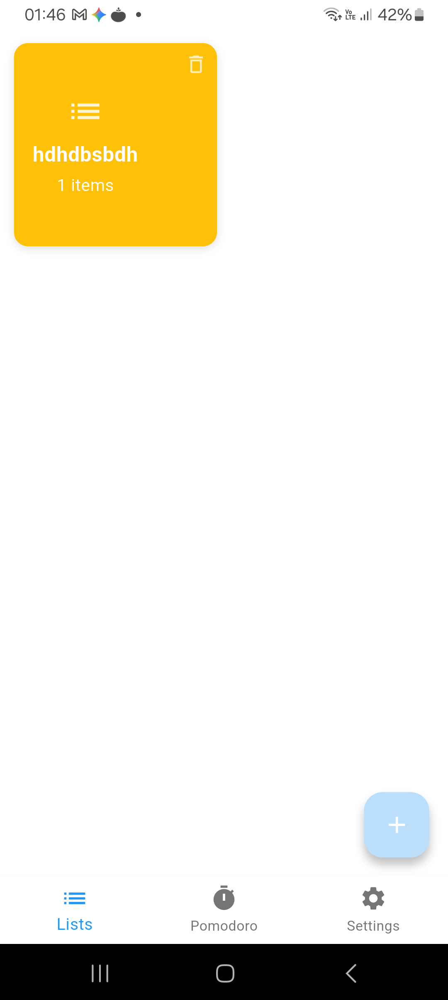
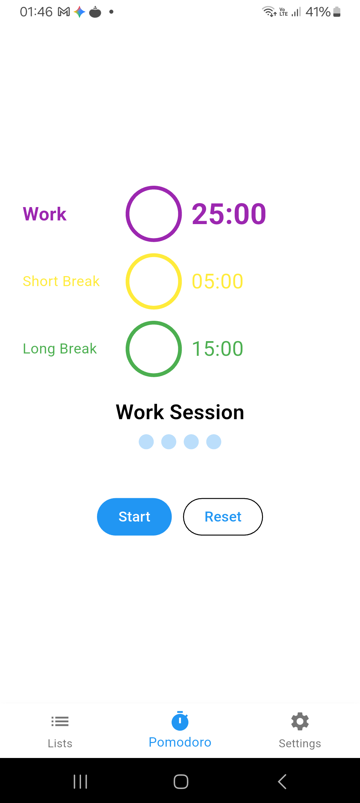
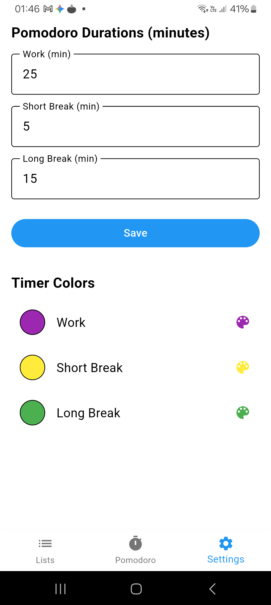

# Birdle/Pomodoro TodoList

A Flutter todo app with SQL persistence, color palettes, item alarms, and a pomodoro timer that survives device reboots.

## Features

- **Todo Lists & Items** — Create, organize, and manage tasks with per-item color coding
- **7 Color Palettes** — Customize the app appearance with built-in themes (default, dark, ocean, sunset, forest, lavender, high contrast)
- **Item Alarms** — Schedule notifications for individual todo items with runtime permission support
- **Pomodoro Timer** — Focus timer with foreground service that persists across device reboots
- **SQL Persistence** — All data stored locally via Drift (SQLite ORM)
- **Boot Recovery** — Alarms and timer state survive device reboots via Android Alarm Manager + WorkManager

## Architecture

Birdle follows an **MVVM + Repository** pattern with **Provider** for state management:

```
┌─────────────────────────────────────────────────────┐
│  UI Layer (Screens + Widgets)                       │
│  └─ Provider Consumers (Consumer widgets)           │
├─────────────────────────────────────────────────────┤
│  ViewModel Layer                                    │
│  └─ ChangeNotifier classes                          │
├─────────────────────────────────────────────────────┤
│  Repository Layer                                   │
│  └─ UserRepository, ListRepository,                 │
│     ItemRepository, PomodoroRepository              │
├─────────────────────────────────────────────────────┤
│  Data Layer                                         │
│  └─ Drift Database (BirdleDatabase)                 │
│  └─ Storage, Alarm, Notification, ForegroundTask    │
└─────────────────────────────────────────────────────┘
```

### Data Models

| Model | Description |
|---|---|
| `User` | App user (name, selected palette) |
| `TodoList` | A collection of todo items |
| `TodoItem` | An individual task with alarm support |
| `PomodoroSession` | Pomodoro timer session state |

### Screens

```
SplashScreen (2s image fade-in)
  → OnboardingPage (name input)
    → AppShell
        ├── PaletteBar (top, 7 palette swatches)
        ├── ListListView (all lists, add with color picker)
        ├── ListItemDetailPage (items, per-item color picker, alarm picker)
        └─  PomodoroWidget (bottom-left floating timer)
```

## Getting Started

### Prerequisites

- Flutter SDK ^3.11.5
- Dart SDK ^3.11.5
- Android SDK (compileSdk 34, targetSdk 34)
- Java 17+

### Setup

```bash
# Clone the repository
git clone <repository-url>
cd birdle

# Get dependencies
flutter pub get

# Generate Drift database code
dart run build_runner build --delete-conflicting-outputs

# Run the app
flutter run
```

### Android Permissions

The app requires the following permissions (requested at runtime where applicable):

| Permission | Purpose |
|---|---|
| `POST_NOTIFICATIONS` | Item alarm notifications (Android 13+) |
| `SCHEDULE_EXACT_ALARM` | Exact alarm scheduling |
| `USE_EXACT_ALARM` | Exact alarm usage |
| `RECEIVE_BOOT_COMPLETED` | Reboot alarm recovery |
| `FOREGROUND_SERVICE` | Pomodoro foreground service |
| `WAKE_LOCK` | Wake lock for timer accuracy |

### Background Services

Birdle uses several Android background mechanisms to ensure reliability:

- **AlarmManager** — Schedules exact alarms for item notifications
- **WorkManager** — Boot receiver to re-register alarms after device restart
- **ForegroundService** — Keeps the Pomodoro timer alive in the background
- **SharedPreferences** — Persists user preferences (name, palette, config)

## Project Structure

```
lib/
├── main.dart                  # Entry point
├── app.dart                   # MaterialApp + route config
├── di/di_container.dart       # Provider dependency injection
├── core/themes/palettes.dart  # 7 color palette definitions
├── data/
│   ├── models/                # Data models
│   ├── repositories/          # Repository implementations
│   └── services/              # DB, storage, alarm, notification, foreground task
└── ui/
    ├── view_models/           # MVVM ViewModels
    ├── screens/               # Screen implementations
    └── widgets/               # Reusable UI components
```

## Testing

```bash
# Run unit tests
flutter test

# Run integration tests
flutter test integration_test/
```

## Dependencies

| Package | Purpose |
|---|---|
| `provider` | State management |
| `drift` + `drift_flutter` | Type-safe SQL ORM |
| `sqflite` | SQLite engine |
| `flutter_local_notifications` | Notification scheduling |
| `android_alarm_manager_plus` | Exact alarm scheduling |
| `workmanager` | Background task scheduling |
| `flutter_foreground_task` | Foreground service |
| `shared_preferences` | Local preferences |
| `permission_handler` | Runtime permissions |
| `audioplayers` | Timer completion sounds |
| `uuid` | Unique ID generation |
| `intl` + `timezone` | Date/time formatting |

## Development

This project uses OpenCode agent orchestration for development. See [AGENTS.md](AGENTS.md) for details on the agent workflow.

### Architecture Documentation

See [doc/architecture.md](doc/architecture.md) for detailed architecture design, data flow diagrams, and service interfaces.

### Development Plan

See [doc/plan.md](doc/plan.md) for the current development roadmap.

## Screenshots

<p align="center">
  
  
  
</p>

*(34 screenshots document the full app UI — see `flutter_*.png` files)*

## License

Internal project — not published to pub.dev.
